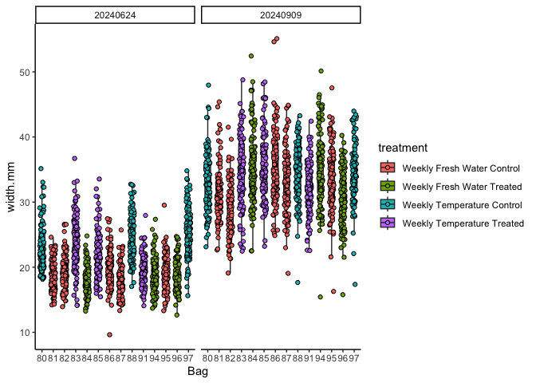
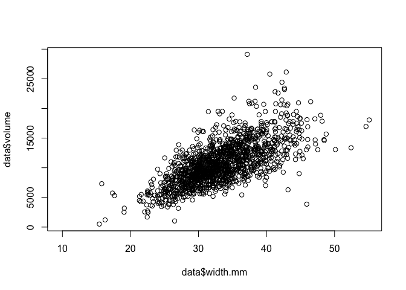
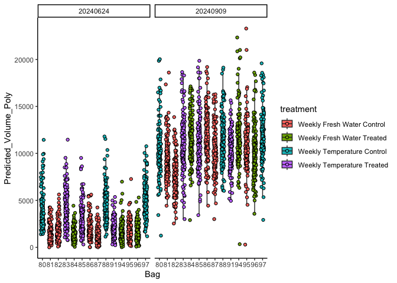
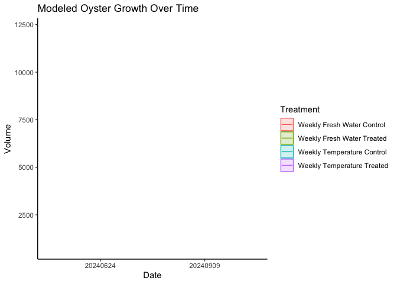
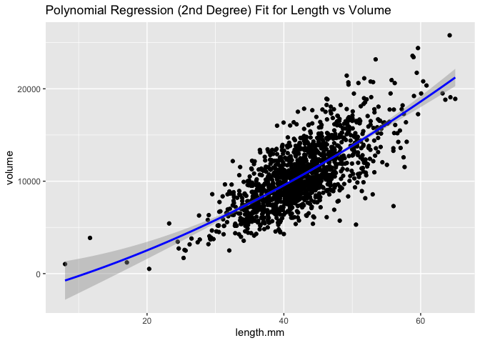
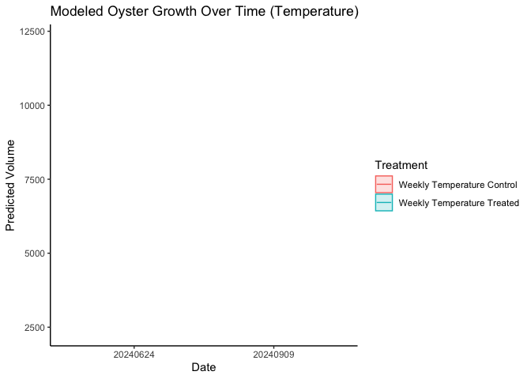

Goose Point oyster size analysis
================
AS Huffmyer
2024

# Set up

Set up workspace, set options, and load required packages.

``` r
knitr::opts_chunk$set(echo = TRUE, warning = FALSE, message = FALSE)
```

Load libraries.

``` r
if ("tidyverse" %in% rownames(installed.packages()) == 'FALSE') install.packages('tidyverse') 
if ("ggplot2" %in% rownames(installed.packages()) == 'FALSE') install.packages('ggplot2') 
if ("ggeffects" %in% rownames(installed.packages()) == 'FALSE') install.packages('ggeffects') 

library("ggplot2")
library("tidyverse")
library("lme4")
library("lmerTest")
library("emmeans")
library("car")
library("mgcv")
library("ggeffects")
library("cowplot")
```

# Load data

Read in data files.

``` r
data<-read_csv(file="data/outplanting/GoosePoint/growth_GoosePoint.csv")
```

Set data attributes.

``` r
data$field_cattle_tag<-factor(data$field_cattle_tag)
```

Set value to 0 for dead or stuck if NA.

``` r
data$dead[is.na(data$dead)] <- 0
data$stuck[is.na(data$stuck)] <- 0
```

Add in treatment information

``` r
metadata<-read_csv(file="data/outplanting/GoosePoint/bag_list_GoosePoint.csv")
metadata$field_cattle_tag<-factor(metadata$field_cattle_tag)

data$treatment<-metadata$treatment[match(data$field_cattle_tag, metadata$field_cattle_tag)]
```

# Plot data

Plot a histogram of each data column to identify any outliers.

``` r
hist(data$length.mm)
```

<!-- -->

``` r
hist(data$width.mm)
```

<!-- -->

``` r
hist(data$depth.mm)
```

<!-- -->

No obvious outliers.

Plot a box plot of length, width, and depth as a function of bag number,
colored by treatment.

``` r
plot1<-data%>%
  ggplot(aes(x=field_cattle_tag, y=length.mm, fill = treatment)) +
  facet_wrap(~date)+
  geom_boxplot(width=.5, outlier.shape= NA, position = position_dodge(width = 0.4)) +
  geom_point(pch = 21, position=position_jitterdodge(dodge.width=0.4)) +
  xlab("Bag") + 
  theme_classic(); plot1
```

<!-- -->

Plot width.

``` r
plot2<-data%>%
  ggplot(aes(x=field_cattle_tag, y=width.mm, fill = treatment)) +
  facet_wrap(~date)+
  geom_boxplot(width=.5, outlier.shape= NA, position = position_dodge(width = 0.4)) +
  geom_point(pch = 21, position=position_jitterdodge(dodge.width=0.4)) +
  xlab("Bag") + 
  theme_classic(); plot2
```

<!-- -->

Plot depth

``` r
plot3<-data%>%
  ggplot(aes(x=field_cattle_tag, y=depth.mm, fill = treatment)) +
  facet_wrap(~date)+
  geom_boxplot(width=.5, outlier.shape= NA, position = position_dodge(width = 0.4)) +
  geom_point(pch = 21, position=position_jitterdodge(dodge.width=0.4)) +
  xlab("Bag") + 
  theme_classic(); plot3
```

<!-- -->

# Generate a metric of volume

Generate an equation to predict depth from length and width using
20240909 data and then use this equation to calculate predicted volume
from length and width for other dates.

Calculate oyster volume as an ellipsoid using known.

``` r
data$volume <- (4/3) * pi * (data$length.mm/2) * (data$width.mm/2) * (data$depth.mm/2)
```

View the relationship between length, width, and volume.

``` r
plot(data$volume ~ data$length.mm)
```

<!-- -->

``` r
plot(data$volume ~ data$width.mm)
```

<!-- -->
Relationships may be non linear.

Obtain training data with known length width and depth from 20240909
dataset.

``` r
training_data<-data%>%
  filter(date=="20240909")%>%
  filter(!is.na(volume))
```

Fit a polynomial regression and a GAM model and compare the fits.

``` r
# Fit a polynomial regression model (2nd-degree polynomial)
poly_model <- lm(volume ~ poly(length.mm, 2) + poly(width.mm, 2) + length.mm:width.mm, data = training_data)

# Fit a Generalized Additive Model (GAM) for comparison
gam_model <- gam(volume ~ s(length.mm, bs = "cs") + s(width.mm, bs = "cs"), data = training_data)

# Compare model summaries
summary(poly_model)
```

    ## 
    ## Call:
    ## lm(formula = volume ~ poly(length.mm, 2) + poly(width.mm, 2) + 
    ##     length.mm:width.mm, data = training_data)
    ## 
    ## Residuals:
    ##     Min      1Q  Median      3Q     Max 
    ## -6344.4 -1118.9  -139.2   950.4  9785.6 
    ## 
    ## Coefficients:
    ##                      Estimate Std. Error t value Pr(>|t|)    
    ## (Intercept)          -914.986   1936.769  -0.472  0.63669    
    ## poly(length.mm, 2)1 11702.736  10669.495   1.097  0.27290    
    ## poly(length.mm, 2)2  5426.512   1931.416   2.810  0.00503 ** 
    ## poly(width.mm, 2)1    751.955  11580.531   0.065  0.94824    
    ## poly(width.mm, 2)2  -5143.753   1916.599  -2.684  0.00736 ** 
    ## length.mm:width.mm      8.191      1.357   6.034 2.04e-09 ***
    ## ---
    ## Signif. codes:  0 '***' 0.001 '**' 0.01 '*' 0.05 '.' 0.1 ' ' 1
    ## 
    ## Residual standard error: 1778 on 1412 degrees of freedom
    ## Multiple R-squared:  0.7583, Adjusted R-squared:  0.7574 
    ## F-statistic: 885.9 on 5 and 1412 DF,  p-value: < 2.2e-16

``` r
summary(gam_model)
```

    ## 
    ## Family: gaussian 
    ## Link function: identity 
    ## 
    ## Formula:
    ## volume ~ s(length.mm, bs = "cs") + s(width.mm, bs = "cs")
    ## 
    ## Parametric coefficients:
    ##             Estimate Std. Error t value Pr(>|t|)    
    ## (Intercept) 10768.05      47.46   226.9   <2e-16 ***
    ## ---
    ## Signif. codes:  0 '***' 0.001 '**' 0.01 '*' 0.05 '.' 0.1 ' ' 1
    ## 
    ## Approximate significance of smooth terms:
    ##                edf Ref.df     F p-value    
    ## s(length.mm) 8.217      9 179.0  <2e-16 ***
    ## s(width.mm)  4.642      9 152.8  <2e-16 ***
    ## ---
    ## Signif. codes:  0 '***' 0.001 '**' 0.01 '*' 0.05 '.' 0.1 ' ' 1
    ## 
    ## R-sq.(adj) =  0.755   Deviance explained = 75.7%
    ## GCV = 3.2255e+06  Scale est. = 3.194e+06  n = 1418

Poly model adjusted R sq = 0.757 GAM model adjusted R sq = 0.755

Both models have similar fits. Plot the models.

``` r
plot(poly_model)
```

<!-- --><!-- --><!-- --><!-- -->

``` r
plot(gam_model)
```

<!-- --><!-- -->

Predict volume using both models and evaluate fits.

``` r
# Predict Volume using the trained model
data$Predicted_Volume_GAM <- predict(gam_model, data)
data$Predicted_Volume_Poly <- predict(poly_model, data)
```

Plot predicted vs actual volume for each model.

``` r
plot(data$Predicted_Volume_GAM ~ data$volume)
```

<!-- -->

``` r
plot(data$Predicted_Volume_Poly ~ data$volume)
```

<!-- -->

Relationships look similar for both models.

Plot GAM relationships

``` r
# Plot the relationship for visualization
ggplot(training_data, aes(x = length.mm, y = volume)) +
  geom_point() +
  geom_smooth(method = "gam", formula = y ~ s(x, bs = "cs"), color = "blue") +
  ggtitle("GAM Fit for Length vs Volume")
```

<!-- -->

``` r
ggplot(training_data, aes(x = width.mm, y = volume)) +
  geom_point() +
  geom_smooth(method = "gam", formula = y ~ s(x, bs = "cs"), color = "red") +
  ggtitle("GAM Fit for Width vs Volume")
```

<!-- -->

Plot Poly relationships

``` r
# Plot polynomial fit for Length vs. Volume
ggplot(training_data, aes(x = length.mm, y = volume)) +
  geom_point() +
  stat_smooth(method = "lm", formula = y ~ poly(x, 2), color = "blue", se = TRUE) +
  ggtitle("Polynomial Regression (2nd Degree) Fit for Length vs Volume")
```

<!-- -->

``` r
# Plot polynomial fit for Width vs. Volume
ggplot(training_data, aes(x = width.mm, y = volume)) +
  geom_point() +
  stat_smooth(method = "lm", formula = y ~ poly(x, 2), color = "red", se = TRUE) +
  ggtitle("Polynomial Regression (2nd Degree) Fit for Width vs Volume")
```

<!-- -->

I am going to select the polynomial model, because the GAM is more
affected by higher observations in width.

View the relationship between known volume and predicted volume using
Polynomial regression.

``` r
# Plot polynomial fit for Length vs. Volume
ggplot(data%>%filter(date=="20240909"), aes(x = volume, y = Predicted_Volume_Poly)) +
  geom_point() +
  stat_smooth(method = "loess", color = "blue", se = TRUE) +
  ggtitle("Polynomial Regression (2nd Degree) Fit for Known vs Predicted Volume")
```

<!-- -->

Model fit looks good for our approximation. Proceed with using predicted
volume calculated by polynomial regression.

Look for outliers.

``` r
hist(data$Predicted_Volume_Poly)
```

<!-- -->

``` r
min(data$Predicted_Volume_Poly)
```

    ## [1] -1316.614

Remove any observation that resulted in a negative value.

``` r
data<-data%>%filter(Predicted_Volume_Poly>0)
hist(data$Predicted_Volume_Poly)
```

<!-- -->

# Analyze growth (volume) over time

## Plot data

``` r
plot4<-data%>%
  ggplot(aes(x=field_cattle_tag, y=Predicted_Volume_Poly, fill = treatment)) +
  facet_wrap(~date)+
  geom_boxplot(width=.5, outlier.shape= NA, position = position_dodge(width = 0.4)) +
  geom_point(pch = 21, position=position_jitterdodge(dodge.width=0.4)) +
  xlab("Bag") + 
  theme_classic(); plot4
```

<!-- -->

Plot summarized by treatment

``` r
plot5<-data%>%
  ggplot(aes(x=treatment, y=Predicted_Volume_Poly, fill = treatment)) +
  facet_wrap(~date)+
  geom_boxplot(width=.5, outlier.shape= NA, position = position_dodge(width = 0.4)) +
  geom_point(pch = 21, position=position_jitterdodge(dodge.width=0.4)) +
  xlab("Treatment") + 
  theme_classic() + 
  theme(axis.text.x=element_text(angle=45, vjust=1, hjust=1)); plot5
```

<!-- -->

Plot summarized by mean and standard error for each bag.

``` r
plot6<-data%>%
  group_by(field_cattle_tag, treatment, date)%>%
  summarise(mean=mean(Predicted_Volume_Poly, na.rm=TRUE), se=sd(Predicted_Volume_Poly, na.rm=TRUE)/sqrt(length(Predicted_Volume_Poly)))%>%
  
  ggplot(aes(x=field_cattle_tag, y=mean, fill = treatment)) +
  facet_wrap(~date)+
  geom_point(pch = 21) +
  geom_errorbar(aes(ymin=mean-se, ymax=mean+se), width=0)+
  xlab("Bag") + 
  ylab("Volume")+
  #ylim(2000, 15000)+
  theme_classic() + 
  theme(axis.text.x=element_text(angle=45, vjust=1, hjust=1)); plot6
```

<!-- -->

``` r
plot7<-data%>%
  group_by(treatment, date)%>%
  summarise(mean=mean(Predicted_Volume_Poly, na.rm=TRUE), se=sd(Predicted_Volume_Poly, na.rm=TRUE)/sqrt(length(Predicted_Volume_Poly)))%>%
  
  ggplot(aes(x=treatment, y=mean, fill = treatment)) +
  facet_wrap(~date)+
  geom_point(pch = 21, size=4) +
  geom_errorbar(aes(ymin=mean-se, ymax=mean+se), width=0)+
  xlab("Treatment") + 
  ylab("Volume")+
  #ylim(5000, 15000)+
  theme_classic() + 
  theme(axis.text.x=element_text(angle=45, vjust=1, hjust=1)); plot7
```

<!-- -->

Sizes vary between treatments at the start of the outplant. We should
calculate percent change with each bag as a replicate.

## Run linear mixed models models

``` r
model<-lmer(sqrt(Predicted_Volume_Poly) ~ treatment * date + (1|field_cattle_tag:treatment), data=data)

summary(model)
```

    ## Linear mixed model fit by REML. t-tests use Satterthwaite's method [
    ## lmerModLmerTest]
    ## Formula: 
    ## sqrt(Predicted_Volume_Poly) ~ treatment * date + (1 | field_cattle_tag:treatment)
    ##    Data: data
    ## 
    ## REML criterion at convergence: 22944.5
    ## 
    ## Scaled residuals: 
    ##     Min      1Q  Median      3Q     Max 
    ## -6.0910 -0.6604 -0.0338  0.6295  3.4932 
    ## 
    ## Random effects:
    ##  Groups                     Name        Variance Std.Dev.
    ##  field_cattle_tag:treatment (Intercept)  19.64    4.431  
    ##  Residual                               211.48   14.542  
    ## Number of obs: 2794, groups:  field_cattle_tag:treatment, 14
    ## 
    ## Fixed effects:
    ##                                            Estimate Std. Error         df
    ## (Intercept)                              -4.240e+06  6.560e+04  1.013e+01
    ## treatmentWeekly Fresh Water Treated      -5.359e+05  1.071e+05  9.727e+01
    ## treatmentWeekly Temperature Control       1.467e+06  1.068e+05  5.741e+01
    ## treatmentWeekly Temperature Treated       7.190e+05  1.066e+05  1.195e+02
    ## date                                      2.095e-01  3.241e-03  1.013e+01
    ## treatmentWeekly Fresh Water Treated:date  2.648e-02  5.291e-03  9.727e+01
    ## treatmentWeekly Temperature Control:date -7.250e-02  5.276e-03  5.741e+01
    ## treatmentWeekly Temperature Treated:date -3.552e-02  5.265e-03  1.195e+02
    ##                                          t value Pr(>|t|)    
    ## (Intercept)                              -64.629 1.37e-14 ***
    ## treatmentWeekly Fresh Water Treated       -5.004 2.49e-06 ***
    ## treatmentWeekly Temperature Control       13.742  < 2e-16 ***
    ## treatmentWeekly Temperature Treated        6.747 5.73e-10 ***
    ## date                                      64.630 1.37e-14 ***
    ## treatmentWeekly Fresh Water Treated:date   5.004 2.49e-06 ***
    ## treatmentWeekly Temperature Control:date -13.742  < 2e-16 ***
    ## treatmentWeekly Temperature Treated:date  -6.747 5.73e-10 ***
    ## ---
    ## Signif. codes:  0 '***' 0.001 '**' 0.01 '*' 0.05 '.' 0.1 ' ' 1
    ## 
    ## Correlation of Fixed Effects:
    ##             (Intr) trWFWT trtWTC trtWTT date   tWFWT: trWTC:
    ## trtmntWkFWT -0.613                                          
    ## trtmntWklTC -0.614  0.376                                   
    ## trtmntWklTT -0.616  0.377  0.378                            
    ## date        -1.000  0.613  0.614  0.616                     
    ## trtmntWFWT:  0.613 -1.000 -0.376 -0.377 -0.613              
    ## trtmntWTCn:  0.614 -0.376 -1.000 -0.378 -0.614  0.376       
    ## trtmntWTTr:  0.616 -0.377 -0.378 -1.000 -0.616  0.377  0.378
    ## fit warnings:
    ## Some predictor variables are on very different scales: consider rescaling

``` r
anova(model)
```

    ## Type III Analysis of Variance Table with Satterthwaite's method
    ##                 Sum Sq Mean Sq NumDF  DenDF F value    Pr(>F)    
    ## date           1934252 1934252     1 639.98 9146.13 < 2.2e-16 ***
    ## treatment:date   70459   23486     3  69.75  111.06 < 2.2e-16 ***
    ## treatment                                                        
    ## ---
    ## Signif. codes:  0 '***' 0.001 '**' 0.01 '*' 0.05 '.' 0.1 ' ' 1

``` r
qqPlot(residuals(model))
```

<!-- -->

    ## [1] 1013  676

``` r
hist(residuals(model))
```

<!-- -->

Different sizes by treatment and treatment by date.

# Analyze growth rates over time

``` r
# Fit a mixed-effects model to estimate growth rate
growth_model <- lmer(Predicted_Volume_Poly ~ date * treatment + (1|treatment:field_cattle_tag), data = data)

# Summarize the model
summary(growth_model)
```

    ## Linear mixed model fit by REML. t-tests use Satterthwaite's method [
    ## lmerModLmerTest]
    ## Formula: 
    ## Predicted_Volume_Poly ~ date * treatment + (1 | treatment:field_cattle_tag)
    ##    Data: data
    ## 
    ## REML criterion at convergence: 51403
    ## 
    ## Scaled residuals: 
    ##     Min      1Q  Median      3Q     Max 
    ## -4.7148 -0.5818 -0.1071  0.4788  5.3313 
    ## 
    ## Random effects:
    ##  Groups                     Name        Variance Std.Dev.
    ##  treatment:field_cattle_tag (Intercept)  499374   706.7  
    ##  Residual                               5775814  2403.3  
    ## Number of obs: 2794, groups:  treatment:field_cattle_tag, 14
    ## 
    ## Fixed effects:
    ##                                            Estimate Std. Error         df
    ## (Intercept)                              -5.889e+08  1.084e+07  3.770e+00
    ## date                                      2.910e+01  5.356e-01  3.770e+00
    ## treatmentWeekly Fresh Water Treated      -9.817e+07  1.770e+07  1.806e+01
    ## treatmentWeekly Temperature Control       1.122e+08  1.765e+07  3.966e+01
    ## treatmentWeekly Temperature Treated       4.264e+07  1.761e+07  2.769e+01
    ## date:treatmentWeekly Fresh Water Treated  4.850e+00  8.743e-01  1.806e+01
    ## date:treatmentWeekly Temperature Control -5.542e+00  8.719e-01  3.966e+01
    ## date:treatmentWeekly Temperature Treated -2.107e+00  8.702e-01  2.769e+01
    ##                                          t value Pr(>|t|)    
    ## (Intercept)                              -54.325 1.35e-06 ***
    ## date                                      54.326 1.35e-06 ***
    ## treatmentWeekly Fresh Water Treated       -5.548 2.85e-05 ***
    ## treatmentWeekly Temperature Control        6.356 1.55e-07 ***
    ## treatmentWeekly Temperature Treated        2.421   0.0223 *  
    ## date:treatmentWeekly Fresh Water Treated   5.548 2.85e-05 ***
    ## date:treatmentWeekly Temperature Control  -6.356 1.55e-07 ***
    ## date:treatmentWeekly Temperature Treated  -2.421   0.0223 *  
    ## ---
    ## Signif. codes:  0 '***' 0.001 '**' 0.01 '*' 0.05 '.' 0.1 ' ' 1
    ## 
    ## Correlation of Fixed Effects:
    ##             (Intr) date   trWFWT trtWTC trtWTT d:WFWT dt:WTC
    ## date        -1.000                                          
    ## trtmntWkFWT -0.613  0.613                                   
    ## trtmntWklTC -0.614  0.614  0.376                            
    ## trtmntWklTT -0.616  0.616  0.377  0.378                     
    ## dt:trtmWFWT  0.613 -0.613 -1.000 -0.376 -0.377              
    ## dt:trtmnWTC  0.614 -0.614 -0.376 -1.000 -0.378  0.376       
    ## dt:trtmnWTT  0.616 -0.616 -0.377 -0.378 -1.000  0.377  0.378
    ## fit warnings:
    ## Some predictor variables are on very different scales: consider rescaling

``` r
anova(growth_model)
```

    ## Type III Analysis of Variance Table with Satterthwaite's method
    ##                    Sum Sq    Mean Sq NumDF   DenDF  F value    Pr(>F)    
    ## date           4.3632e+10 4.3632e+10     1 126.748 7554.313 < 2.2e-16 ***
    ## date:treatment 6.9239e+08 2.3080e+08     3  23.003   39.959 2.748e-09 ***
    ## treatment                                                                
    ## ---
    ## Signif. codes:  0 '***' 0.001 '**' 0.01 '*' 0.05 '.' 0.1 ' ' 1

``` r
# Extract fixed effects (overall growth rate) and random effects (bag-specific deviations)
fixed_effects <- fixef(growth_model)
random_effects <- ranef(growth_model)$`treatment:field_cattle_tag`

# Plot growth trajectories
ggplot(data, aes(x = date, y = Predicted_Volume_Poly, color = factor(treatment))) +
  geom_point() +
  geom_smooth(method = "lm", se = FALSE) +
  theme_minimal() +
  labs(title = "Oyster Growth Over Time",
       x = "Date",
       y = "Volume",
       color = "Treatment")
```

<!-- -->

``` r
#plot model trajectories 
ggpred <- ggpredict(growth_model, terms = c("date", "treatment"))
ggplot(ggpred, aes(x = x, y = predicted, color = group, fill=group)) +
  geom_line() +
  geom_ribbon(aes(ymin = conf.low, ymax = conf.high), alpha = 0.2) +
  theme_classic() +
  
  labs(title = "Modeled Oyster Growth Over Time",
       x = "Date",
       y = "Volume",
       color = "Treatment", 
       fill = "Treatment")
```

<!-- -->

No difference between treated and control within each group.

Analyze each effort separately.

Weekly fresh water group:

``` r
fresh_data<-data[grepl("Fresh Water", data$treatment), ]

# Fit a mixed-effects model to estimate growth rate
growth_model_FW <- lmer(Predicted_Volume_Poly ~ date * treatment + (1|treatment:field_cattle_tag), data = fresh_data)

# Summarize the model
summary(growth_model_FW)
```

    ## Linear mixed model fit by REML. t-tests use Satterthwaite's method [
    ## lmerModLmerTest]
    ## Formula: 
    ## Predicted_Volume_Poly ~ date * treatment + (1 | treatment:field_cattle_tag)
    ##    Data: fresh_data
    ## 
    ## REML criterion at convergence: 29022.3
    ## 
    ## Scaled residuals: 
    ##     Min      1Q  Median      3Q     Max 
    ## -5.0225 -0.5278 -0.1031  0.4465  5.6757 
    ## 
    ## Random effects:
    ##  Groups                     Name        Variance Std.Dev.
    ##  treatment:field_cattle_tag (Intercept)  524565   724.3  
    ##  Residual                               5092882  2256.7  
    ## Number of obs: 1588, groups:  treatment:field_cattle_tag, 8
    ## 
    ## Fixed effects:
    ##                                            Estimate Std. Error         df
    ## (Intercept)                              -5.889e+08  1.018e+07  1.716e+02
    ## date                                      2.910e+01  5.029e-01  1.716e+02
    ## treatmentWeekly Fresh Water Treated      -9.819e+07  1.662e+07  8.944e+02
    ## date:treatmentWeekly Fresh Water Treated  4.851e+00  8.210e-01  8.944e+02
    ##                                          t value Pr(>|t|)    
    ## (Intercept)                              -57.852  < 2e-16 ***
    ## date                                      57.853  < 2e-16 ***
    ## treatmentWeekly Fresh Water Treated       -5.908 4.91e-09 ***
    ## date:treatmentWeekly Fresh Water Treated   5.908 4.90e-09 ***
    ## ---
    ## Signif. codes:  0 '***' 0.001 '**' 0.01 '*' 0.05 '.' 0.1 ' ' 1
    ## 
    ## Correlation of Fixed Effects:
    ##             (Intr) date   trWFWT
    ## date        -1.000              
    ## trtmntWkFWT -0.613  0.613       
    ## dt:trtmWFWT  0.613 -0.613 -1.000
    ## fit warnings:
    ## Some predictor variables are on very different scales: consider rescaling

``` r
anova(growth_model_FW)
```

    ## Type III Analysis of Variance Table with Satterthwaite's method
    ##                    Sum Sq    Mean Sq NumDF  DenDF F value    Pr(>F)    
    ## date           3.0031e+10 3.0031e+10     1 730.77 5896.61 < 2.2e-16 ***
    ## date:treatment 1.7779e+08 1.7779e+08     1 894.39   34.91 4.904e-09 ***
    ## treatment                                                              
    ## ---
    ## Signif. codes:  0 '***' 0.001 '**' 0.01 '*' 0.05 '.' 0.1 ' ' 1

``` r
# Extract fixed effects (overall growth rate) and random effects (bag-specific deviations)
fixed_effects <- fixef(growth_model_FW)
random_effects <- ranef(growth_model_FW)$`treatment:field_cattle_tag`

# Plot growth trajectories
ggplot(fresh_data, aes(x = date, y = Predicted_Volume_Poly, color = factor(treatment))) +
  geom_point() +
  geom_smooth(method = "lm", se = FALSE) +
  theme_minimal() +
  labs(title = "Oyster Growth Over Time",
       x = "Date",
       y = "Volume",
       color = "Treatment")
```

<!-- -->

``` r
#plot model trajectories 
ggpred <- ggpredict(growth_model_FW, terms = c("date", "treatment"))
plot1<-ggplot(ggpred, aes(x = x, y = predicted, color = group, fill=group)) +
  geom_line() +
  geom_ribbon(aes(ymin = conf.low, ymax = conf.high), alpha = 0.2) +
  theme_classic() +
  
  labs(title = "Modeled Oyster Growth Over Time (Fresh Water)",
       x = "Date",
       y = "Predicted Volume",
       color = "Treatment", 
       fill = "Treatment");plot1
```

<!-- -->

No difference between control and treated in the fresh water experiment.

Weekly temperature group:

``` r
temp_data<-data[grepl("Temperature", data$treatment), ]

# Fit a mixed-effects model to estimate growth rate
growth_model_TEMP <- lmer(Predicted_Volume_Poly ~ date * treatment + (1|treatment:field_cattle_tag), data = temp_data)

# Summarize the model
summary(growth_model_TEMP)
```

    ## Linear mixed model fit by REML. t-tests use Satterthwaite's method [
    ## lmerModLmerTest]
    ## Formula: 
    ## Predicted_Volume_Poly ~ date * treatment + (1 | treatment:field_cattle_tag)
    ##    Data: temp_data
    ## 
    ## REML criterion at convergence: 22355.5
    ## 
    ## Scaled residuals: 
    ##     Min      1Q  Median      3Q     Max 
    ## -3.6941 -0.6301 -0.1302  0.5472  3.5732 
    ## 
    ## Random effects:
    ##  Groups                     Name        Variance Std.Dev.
    ##  treatment:field_cattle_tag (Intercept)  463935   681.1  
    ##  Residual                               6675304  2583.7  
    ## Number of obs: 1206, groups:  treatment:field_cattle_tag, 6
    ## 
    ## Fixed effects:
    ##                                            Estimate Std. Error         df
    ## (Intercept)                              -4.768e+08  1.497e+07  4.307e+01
    ## date                                      2.356e+01  7.396e-01  4.307e+01
    ## treatmentWeekly Temperature Treated      -6.955e+07  2.114e+07  3.855e+02
    ## date:treatmentWeekly Temperature Treated  3.436e+00  1.044e+00  3.855e+02
    ##                                          t value Pr(>|t|)    
    ## (Intercept)                               -31.85  < 2e-16 ***
    ## date                                       31.85  < 2e-16 ***
    ## treatmentWeekly Temperature Treated        -3.29  0.00109 ** 
    ## date:treatmentWeekly Temperature Treated    3.29  0.00109 ** 
    ## ---
    ## Signif. codes:  0 '***' 0.001 '**' 0.01 '*' 0.05 '.' 0.1 ' ' 1
    ## 
    ## Correlation of Fixed Effects:
    ##             (Intr) date   trtWTT
    ## date        -1.000              
    ## trtmntWklTT -0.708  0.708       
    ## dt:trtmnWTT  0.708 -0.708 -1.000
    ## fit warnings:
    ## Some predictor variables are on very different scales: consider rescaling

``` r
anova(growth_model_TEMP)
```

    ## Type III Analysis of Variance Table with Satterthwaite's method
    ##                    Sum Sq    Mean Sq NumDF  DenDF  F value    Pr(>F)    
    ## date           1.5639e+10 1.5639e+10     1 318.45 2342.833 < 2.2e-16 ***
    ## date:treatment 7.2266e+07 7.2266e+07     1 385.53   10.826  0.001093 ** 
    ## treatment                                                               
    ## ---
    ## Signif. codes:  0 '***' 0.001 '**' 0.01 '*' 0.05 '.' 0.1 ' ' 1

``` r
# Extract fixed effects (overall growth rate) and random effects (bag-specific deviations)
fixed_effects <- fixef(growth_model_TEMP)
random_effects <- ranef(growth_model_TEMP)$`treatment:field_cattle_tag`

# Plot growth trajectories
ggplot(temp_data, aes(x = date, y = Predicted_Volume_Poly, color = factor(treatment))) +
  geom_point() +
  geom_smooth(method = "lm", se = FALSE) +
  theme_minimal() +
  labs(title = "Oyster Growth Over Time",
       x = "Date",
       y = "Volume",
       color = "Treatment")
```

<!-- -->

``` r
#plot model trajectories 
ggpred <- ggpredict(growth_model_TEMP, terms = c("date", "treatment"))
plot2<-ggplot(ggpred, aes(x = x, y = predicted, color = group, fill=group)) +
  geom_line() +
  geom_ribbon(aes(ymin = conf.low, ymax = conf.high), alpha = 0.2) +
  theme_classic() +
  
  labs(title = "Modeled Oyster Growth Over Time (Temperature)",
       x = "Date",
       y = "Predicted Volume",
       color = "Treatment", 
       fill = "Treatment");plot2
```

<!-- -->

No clear difference between control and treated in the temperature
experiment.

``` r
plots<-plot_grid(plot1, plot2, ncol=2, nrow=1);plots
```

<!-- -->

``` r
ggsave(filename="figures/growth/goose_point/growth.png", plots, width=14, height=6)
```
