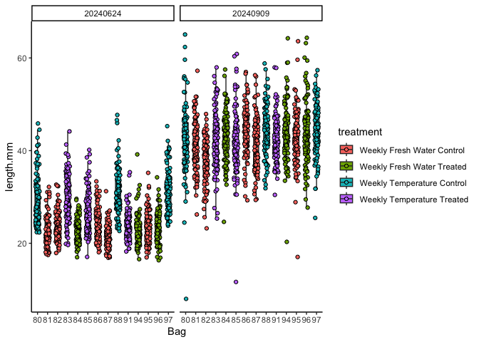
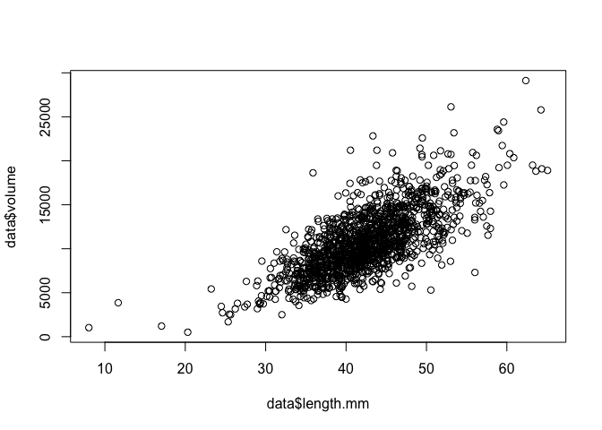
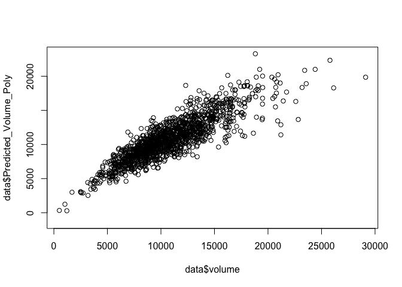

Goose Point oyster size analysis
================
AS Huffmyer
2024

# Set up

Set up workspace, set options, and load required packages.

``` r
knitr::opts_chunk$set(echo = TRUE, warning = FALSE, message = FALSE)
```

Load libraries.

``` r
if ("tidyverse" %in% rownames(installed.packages()) == 'FALSE') install.packages('tidyverse') 
if ("ggplot2" %in% rownames(installed.packages()) == 'FALSE') install.packages('ggplot2') 
if ("ggeffects" %in% rownames(installed.packages()) == 'FALSE') install.packages('ggeffects') 

library("ggplot2")
library("tidyverse")
library("lme4")
library("lmerTest")
library("emmeans")
library("car")
library("mgcv")
library("ggeffects")
library("cowplot")
```

# Load data

Read in data files.

``` r
data<-read_csv(file="data/outplanting/GoosePoint/growth_GoosePoint.csv")%>%
  mutate(date=as.factor(date))
```

Set data attributes.

``` r
data$field_cattle_tag<-factor(data$field_cattle_tag)
```

Set value to 0 for dead or stuck if NA.

``` r
data$dead[is.na(data$dead)] <- 0
data$stuck[is.na(data$stuck)] <- 0
```

Add in treatment information

``` r
metadata<-read_csv(file="data/outplanting/GoosePoint/bag_list_GoosePoint.csv")
metadata$field_cattle_tag<-factor(metadata$field_cattle_tag)

data$treatment<-metadata$treatment[match(data$field_cattle_tag, metadata$field_cattle_tag)]
```

# Plot data

Plot a histogram of each data column to identify any outliers.

``` r
hist(data$length.mm)
```

<!-- -->

``` r
hist(data$width.mm)
```

<!-- -->

``` r
hist(data$depth.mm)
```

<!-- -->

No obvious outliers.

Plot a box plot of length, width, and depth as a function of bag number,
colored by treatment.

``` r
plot1<-data%>%
  ggplot(aes(x=field_cattle_tag, y=length.mm, fill = treatment)) +
  facet_wrap(~date)+
  geom_boxplot(width=.5, outlier.shape= NA, position = position_dodge(width = 0.4)) +
  geom_point(pch = 21, position=position_jitterdodge(dodge.width=0.4)) +
  xlab("Bag") + 
  theme_classic(); plot1
```

<!-- -->

Plot width.

``` r
plot2<-data%>%
  ggplot(aes(x=field_cattle_tag, y=width.mm, fill = treatment)) +
  facet_wrap(~date)+
  geom_boxplot(width=.5, outlier.shape= NA, position = position_dodge(width = 0.4)) +
  geom_point(pch = 21, position=position_jitterdodge(dodge.width=0.4)) +
  xlab("Bag") + 
  theme_classic(); plot2
```

<!-- -->

Plot depth

``` r
plot3<-data%>%
  ggplot(aes(x=field_cattle_tag, y=depth.mm, fill = treatment)) +
  facet_wrap(~date)+
  geom_boxplot(width=.5, outlier.shape= NA, position = position_dodge(width = 0.4)) +
  geom_point(pch = 21, position=position_jitterdodge(dodge.width=0.4)) +
  xlab("Bag") + 
  theme_classic(); plot3
```

<!-- -->

# Generate a metric of volume

Generate an equation to predict depth from length and width using
20240909 data and then use this equation to calculate predicted volume
from length and width for other dates.

Calculate oyster volume as an ellipsoid using known.

``` r
data$volume <- (4/3) * pi * (data$length.mm/2) * (data$width.mm/2) * (data$depth.mm/2)
```

View the relationship between length, width, and volume.

``` r
plot(data$volume ~ data$length.mm)
```

<!-- -->

``` r
plot(data$volume ~ data$width.mm)
```

<!-- -->
Relationships may be non linear.

Obtain training data with known length width and depth from 20240909
dataset.

``` r
training_data<-data%>%
  filter(date=="20240909")%>%
  filter(!is.na(volume))

hist(training_data$volume)
```

<!-- -->

Fit a polynomial regression and a GAM model and compare the fits.

``` r
# Fit a polynomial regression model (2nd-degree polynomial)
poly_model <- lm(volume ~ poly(length.mm, 2) + poly(width.mm, 2) + length.mm:width.mm, data = training_data)

# Fit a Generalized Additive Model (GAM) for comparison
gam_model <- gam(volume ~ s(length.mm, bs = "cs") + s(width.mm, bs = "cs"), data = training_data)

# Compare model summaries
summary(poly_model)
```

    ## 
    ## Call:
    ## lm(formula = volume ~ poly(length.mm, 2) + poly(width.mm, 2) + 
    ##     length.mm:width.mm, data = training_data)
    ## 
    ## Residuals:
    ##     Min      1Q  Median      3Q     Max 
    ## -6344.4 -1118.9  -139.2   950.4  9785.6 
    ## 
    ## Coefficients:
    ##                      Estimate Std. Error t value Pr(>|t|)    
    ## (Intercept)          -914.986   1936.769  -0.472  0.63669    
    ## poly(length.mm, 2)1 11702.736  10669.495   1.097  0.27290    
    ## poly(length.mm, 2)2  5426.512   1931.416   2.810  0.00503 ** 
    ## poly(width.mm, 2)1    751.955  11580.531   0.065  0.94824    
    ## poly(width.mm, 2)2  -5143.753   1916.599  -2.684  0.00736 ** 
    ## length.mm:width.mm      8.191      1.357   6.034 2.04e-09 ***
    ## ---
    ## Signif. codes:  0 '***' 0.001 '**' 0.01 '*' 0.05 '.' 0.1 ' ' 1
    ## 
    ## Residual standard error: 1778 on 1412 degrees of freedom
    ## Multiple R-squared:  0.7583, Adjusted R-squared:  0.7574 
    ## F-statistic: 885.9 on 5 and 1412 DF,  p-value: < 2.2e-16

``` r
summary(gam_model)
```

    ## 
    ## Family: gaussian 
    ## Link function: identity 
    ## 
    ## Formula:
    ## volume ~ s(length.mm, bs = "cs") + s(width.mm, bs = "cs")
    ## 
    ## Parametric coefficients:
    ##             Estimate Std. Error t value Pr(>|t|)    
    ## (Intercept) 10768.05      47.46   226.9   <2e-16 ***
    ## ---
    ## Signif. codes:  0 '***' 0.001 '**' 0.01 '*' 0.05 '.' 0.1 ' ' 1
    ## 
    ## Approximate significance of smooth terms:
    ##                edf Ref.df     F p-value    
    ## s(length.mm) 8.217      9 179.0  <2e-16 ***
    ## s(width.mm)  4.642      9 152.8  <2e-16 ***
    ## ---
    ## Signif. codes:  0 '***' 0.001 '**' 0.01 '*' 0.05 '.' 0.1 ' ' 1
    ## 
    ## R-sq.(adj) =  0.755   Deviance explained = 75.7%
    ## GCV = 3.2255e+06  Scale est. = 3.194e+06  n = 1418

Poly model adjusted R sq = 0.757 GAM model adjusted R sq = 0.755

Both models have similar fits. Plot the models.

``` r
plot(poly_model)
```

<!-- --><!-- --><!-- --><!-- -->

``` r
plot(gam_model)
```

<!-- --><!-- -->

Predict volume using both models and evaluate fits.

``` r
# Predict Volume using the trained model
data$Predicted_Volume_GAM <- predict(gam_model, data)
data$Predicted_Volume_Poly <- predict(poly_model, data)
```

Plot predicted vs actual volume for each model.

``` r
plot(data$Predicted_Volume_GAM ~ data$volume)
```

<!-- -->

``` r
plot(data$Predicted_Volume_Poly ~ data$volume)
```

<!-- -->

Relationships look similar for both models.

Plot GAM relationships

``` r
# Plot the relationship for visualization
ggplot(training_data, aes(x = length.mm, y = volume)) +
  geom_point() +
  geom_smooth(method = "gam", formula = y ~ s(x, bs = "cs"), color = "blue") +
  ggtitle("GAM Fit for Length vs Volume")
```

<!-- -->

``` r
ggplot(training_data, aes(x = width.mm, y = volume)) +
  geom_point() +
  geom_smooth(method = "gam", formula = y ~ s(x, bs = "cs"), color = "red") +
  ggtitle("GAM Fit for Width vs Volume")
```

<!-- -->

Plot Poly relationships

``` r
# Plot polynomial fit for Length vs. Volume
ggplot(training_data, aes(x = length.mm, y = volume)) +
  geom_point() +
  stat_smooth(method = "lm", formula = y ~ poly(x, 2), color = "blue", se = TRUE) +
  ggtitle("Polynomial Regression (2nd Degree) Fit for Length vs Volume")
```

<!-- -->

``` r
# Plot polynomial fit for Width vs. Volume
ggplot(training_data, aes(x = width.mm, y = volume)) +
  geom_point() +
  stat_smooth(method = "lm", formula = y ~ poly(x, 2), color = "red", se = TRUE) +
  ggtitle("Polynomial Regression (2nd Degree) Fit for Width vs Volume")
```

<!-- -->

I am going to select the polynomial model, because the GAM is more
affected by higher observations in width.

View the relationship between known volume and predicted volume using
Polynomial regression.

``` r
# Plot polynomial fit for Length vs. Volume
ggplot(data%>%filter(date=="20240909"), aes(x = volume, y = Predicted_Volume_Poly)) +
  geom_point() +
  stat_smooth(method = "loess", color = "blue", se = TRUE) +
  ggtitle("Polynomial Regression (2nd Degree) Fit for Known vs Predicted Volume")
```

<!-- -->

Model fit looks good for our approximation. Proceed with using predicted
volume calculated by polynomial regression.

Look for outliers.

``` r
hist(data$Predicted_Volume_Poly)
```

<!-- -->

``` r
min(data$Predicted_Volume_Poly)
```

    ## [1] -1316.614

Remove outliers and reconstruct polynomial model.

There are several outliers. Conduct outlier removal and analyze again.

``` r
# Fit a polynomial regression model (2nd-degree polynomial)
poly_model <- lm(volume ~ poly(length.mm, 2) + poly(width.mm, 2) + length.mm:width.mm, data = training_data)

# Extract raw residuals
training_data$raw_resid <- residuals(poly_model)

# Standardize residuals
training_data$std_resid <- training_data$raw_resid / sd(training_data$raw_resid)

# Flag potential outliers
outlier_threshold <- 3
training_data$outlier_flag <- abs(training_data$std_resid) > outlier_threshold

# Filter rows flagged as outliers
outliers <- training_data %>% filter(outlier_flag == TRUE)
print(outliers)
```

    ## # A tibble: 17 × 14
    ##    field_cattle_tag date     oyster length.mm width.mm depth.mm  dead stuck
    ##    <fct>            <fct>     <dbl>     <dbl>    <dbl>    <dbl> <dbl> <dbl>
    ##  1 83               20240909     63      58.0     38.6     10.5     0     0
    ##  2 91               20240909     68      42.4     35.2     22.6     0     0
    ##  3 86               20240909     79      44.2     30.7     22.6     0     0
    ##  4 95               20240909     20      43.8     38.3     24.1     0     0
    ##  5 95               20240909     32      46.2     29.9     22.1     0     0
    ##  6 88               20240909      4      43.8     41.3     20.6     0     0
    ##  7 88               20240909     32      49.5     41.7     20.9     0     0
    ##  8 88               20240909     92      41.8     35.5     23.0     0     0
    ##  9 96               20240909     53      53.5     31.4     22.1     0     0
    ## 10 97               20240909     20      40.6     37.4     26.7     0     0
    ## 11 97               20240909     27      53.0     42.9     21.9     0     0
    ## 12 97               20240909     31      40.5     32.1     22.6     0     0
    ## 13 97               20240909     85      43.3     41.3     24.4     0     0
    ## 14 80               20240909      9      45.8     37.8     23.0     0     0
    ## 15 80               20240909     23      40.5     39.2     21.0     0     0
    ## 16 80               20240909     26      62.4     37.2     24       0     0
    ## 17 80               20240909     37      35.9     44.6     22.2     0     0
    ## # ℹ 6 more variables: image.name <chr>, treatment <chr>, volume <dbl>,
    ## #   raw_resid <dbl>, std_resid <dbl>, outlier_flag <lgl>

``` r
# Plot standardized residuals
ggplot(training_data, aes(x = seq_along(std_resid), y = std_resid)) +
  geom_point(aes(color = outlier_flag), size = 2) +
  geom_hline(yintercept = c(-outlier_threshold, outlier_threshold), linetype = "dashed", color = "red") +
  labs(title = "Standardized Residuals with Outliers", x = "Index", y = "Standardized Residual") +
  theme_minimal()
```

<!-- -->

Re run the model after removing outliers.

``` r
training_data<-training_data%>%
  filter(!outlier_flag==TRUE)
```

``` r
hist(training_data$volume)
```

<!-- -->

Fit a polynomial regression.

``` r
# Fit a polynomial regression model (2nd-degree polynomial)
poly_model <- lm(volume ~ poly(length.mm, 2) + poly(width.mm, 2) + length.mm:width.mm, data = training_data)

# Compare model summaries
summary(poly_model)
```

    ## 
    ## Call:
    ## lm(formula = volume ~ poly(length.mm, 2) + poly(width.mm, 2) + 
    ##     length.mm:width.mm, data = training_data)
    ## 
    ## Residuals:
    ##     Min      1Q  Median      3Q     Max 
    ## -4833.7 -1081.6  -107.2   972.8  5346.1 
    ## 
    ## Coefficients:
    ##                      Estimate Std. Error t value Pr(>|t|)    
    ## (Intercept)         -1193.278   1754.953  -0.680  0.49665    
    ## poly(length.mm, 2)1  9908.733   9580.290   1.034  0.30118    
    ## poly(length.mm, 2)2  4987.905   1740.529   2.866  0.00422 ** 
    ## poly(width.mm, 2)1  -2523.763  10441.295  -0.242  0.80904    
    ## poly(width.mm, 2)2  -5249.791   1731.549  -3.032  0.00248 ** 
    ## length.mm:width.mm      8.331      1.233   6.756 2.07e-11 ***
    ## ---
    ## Signif. codes:  0 '***' 0.001 '**' 0.01 '*' 0.05 '.' 0.1 ' ' 1
    ## 
    ## Residual standard error: 1605 on 1395 degrees of freedom
    ## Multiple R-squared:  0.7865, Adjusted R-squared:  0.7857 
    ## F-statistic:  1028 on 5 and 1395 DF,  p-value: < 2.2e-16

R sq improved to 0.785

``` r
plot(poly_model)
```

<!-- --><!-- --><!-- --><!-- -->

Predict volume using poly model and evaluate fits.

``` r
# Predict Volume using the trained model
data$Predicted_Volume_Poly <- predict(poly_model, data)
```

Plot predicted vs actual volume for each model.

``` r
plot(data$Predicted_Volume_Poly ~ data$volume)
```

<!-- -->

Plot Poly model relationships

``` r
# Plot polynomial fit for Length vs. Volume
ggplot(training_data, aes(x = length.mm, y = volume)) +
  geom_point() +
  stat_smooth(method = "lm", formula = y ~ poly(x, 2), color = "blue", se = TRUE) +
  ggtitle("Polynomial Regression (2nd Degree) Fit for Length vs Volume")
```

<!-- -->

``` r
# Plot polynomial fit for Width vs. Volume
ggplot(training_data, aes(x = width.mm, y = volume)) +
  geom_point() +
  stat_smooth(method = "lm", formula = y ~ poly(x, 2), color = "red", se = TRUE) +
  ggtitle("Polynomial Regression (2nd Degree) Fit for Width vs Volume")
```

<!-- -->

View the relationship between known volume and predicted volume using
Polynomial regression.

``` r
# Plot polynomial fit for Length vs. Volume
ggplot(data%>%filter(date=="20240909"), aes(x = volume, y = Predicted_Volume_Poly)) +
  geom_point() +
  stat_smooth(method = "loess", color = "blue", se = TRUE) +
  ggtitle("Polynomial Regression (2nd Degree) Fit for Known vs Predicted Volume")
```

<!-- -->

Model fit looks good for our approximation. Proceed with using predicted
volume calculated by polynomial regression.

Look for outliers.

``` r
hist(data$Predicted_Volume_Poly)
```

<!-- -->

``` r
min(data$Predicted_Volume_Poly)
```

    ## [1] -1124.542

There are fewer negative values than the first iteration of the model.

Remove any observation that resulted in a negative value.

``` r
data<-data%>%filter(Predicted_Volume_Poly>0)
hist(data$Predicted_Volume_Poly)
```

<!-- -->

Proceed with the calculated volume data.

# Analyze growth (volume) over time

## Plot data

``` r
plot4<-data%>%
  ggplot(aes(x=field_cattle_tag, y=Predicted_Volume_Poly, fill = treatment)) +
  facet_wrap(~date)+
  geom_boxplot(width=.5, outlier.shape= NA, position = position_dodge(width = 0.4)) +
  geom_point(pch = 21, position=position_jitterdodge(dodge.width=0.4)) +
  xlab("Bag") + 
  theme_classic(); plot4
```

<!-- -->

Plot summarized by treatment

``` r
plot5<-data%>%
  ggplot(aes(x=treatment, y=Predicted_Volume_Poly, fill = treatment)) +
  facet_wrap(~date)+
  geom_boxplot(width=.5, outlier.shape= NA, position = position_dodge(width = 0.4)) +
  geom_point(pch = 21, position=position_jitterdodge(dodge.width=0.4)) +
  xlab("Treatment") + 
  theme_classic() + 
  theme(axis.text.x=element_text(angle=45, vjust=1, hjust=1)); plot5
```

<!-- -->

Plot summarized by mean and standard error for each bag.

``` r
plot6<-data%>%
  group_by(field_cattle_tag, treatment, date)%>%
  summarise(mean=mean(Predicted_Volume_Poly, na.rm=TRUE), se=sd(Predicted_Volume_Poly, na.rm=TRUE)/sqrt(length(Predicted_Volume_Poly)))%>%
  
  ggplot(aes(x=field_cattle_tag, y=mean, fill = treatment)) +
  facet_wrap(~date)+
  geom_point(pch = 21) +
  geom_errorbar(aes(ymin=mean-se, ymax=mean+se), width=0)+
  xlab("Bag") + 
  ylab("Volume")+
  #ylim(2000, 15000)+
  theme_classic() + 
  theme(axis.text.x=element_text(angle=45, vjust=1, hjust=1)); plot6
```

<!-- -->

``` r
plot7<-data%>%
  group_by(treatment, date)%>%
  summarise(mean=mean(Predicted_Volume_Poly, na.rm=TRUE), se=sd(Predicted_Volume_Poly, na.rm=TRUE)/sqrt(length(Predicted_Volume_Poly)))%>%
  
  ggplot(aes(x=treatment, y=mean, fill = treatment)) +
  facet_wrap(~date)+
  geom_point(pch = 21, size=4) +
  geom_errorbar(aes(ymin=mean-se, ymax=mean+se), width=0)+
  xlab("Treatment") + 
  ylab("Volume")+
  #ylim(5000, 15000)+
  theme_classic() + 
  theme(axis.text.x=element_text(angle=45, vjust=1, hjust=1)); plot7
```

<!-- -->

Sizes vary between treatments at the start of the outplant. We will
examine growth using models to calculate slopes of change in volume over
time.

## Run linear mixed models models

``` r
model<-lmer(sqrt(Predicted_Volume_Poly) ~ treatment * date + (1|field_cattle_tag:treatment), data=data)

summary(model)
```

    ## Linear mixed model fit by REML. t-tests use Satterthwaite's method [
    ## lmerModLmerTest]
    ## Formula: 
    ## sqrt(Predicted_Volume_Poly) ~ treatment * date + (1 | field_cattle_tag:treatment)
    ##    Data: data
    ## 
    ## REML criterion at convergence: 22902.1
    ## 
    ## Scaled residuals: 
    ##     Min      1Q  Median      3Q     Max 
    ## -5.9553 -0.6477 -0.0375  0.6260  3.5300 
    ## 
    ## Random effects:
    ##  Groups                     Name        Variance Std.Dev.
    ##  field_cattle_tag:treatment (Intercept)  18.11    4.256  
    ##  Residual                               203.22   14.255  
    ## Number of obs: 2808, groups:  field_cattle_tag:treatment, 14
    ## 
    ## Fixed effects:
    ##                                                   Estimate Std. Error        df
    ## (Intercept)                                        40.2750     2.0088   11.1260
    ## treatmentWeekly Fresh Water Treated                -1.5695     3.2799   11.1201
    ## treatmentWeekly Temperature Control                26.8105     3.2788   11.1059
    ## treatmentWeekly Temperature Treated                13.8884     3.2788   11.1059
    ## date20240909                                       58.3058     0.9026 2790.0356
    ## treatmentWeekly Fresh Water Treated:date20240909    7.6232     1.4715 2790.0148
    ## treatmentWeekly Temperature Control:date20240909  -20.0032     1.4722 2790.0148
    ## treatmentWeekly Temperature Treated:date20240909   -9.5667     1.4677 2790.0206
    ##                                                  t value Pr(>|t|)    
    ## (Intercept)                                       20.050 4.38e-10 ***
    ## treatmentWeekly Fresh Water Treated               -0.479  0.64155    
    ## treatmentWeekly Temperature Control                8.177 4.98e-06 ***
    ## treatmentWeekly Temperature Treated                4.236  0.00137 ** 
    ## date20240909                                      64.597  < 2e-16 ***
    ## treatmentWeekly Fresh Water Treated:date20240909   5.181 2.37e-07 ***
    ## treatmentWeekly Temperature Control:date20240909 -13.588  < 2e-16 ***
    ## treatmentWeekly Temperature Treated:date20240909  -6.518 8.41e-11 ***
    ## ---
    ## Signif. codes:  0 '***' 0.001 '**' 0.01 '*' 0.05 '.' 0.1 ' ' 1
    ## 
    ## Correlation of Fixed Effects:
    ##             (Intr) trWFWT trtWTC trtWTT d20240 tWFWT: tWTC:2
    ## trtmntWkFWT -0.612                                          
    ## trtmntWklTC -0.613  0.375                                   
    ## trtmntWklTT -0.613  0.375  0.375                            
    ## dat20240909 -0.227  0.139  0.139  0.139                     
    ## tWFWT:20240  0.139 -0.227 -0.085 -0.085 -0.613              
    ## tWTC:202409  0.139 -0.085 -0.226 -0.085 -0.613  0.376       
    ## tWTT:202409  0.140 -0.086 -0.086 -0.226 -0.615  0.377  0.377

``` r
anova(model)
```

    ## Type III Analysis of Variance Table with Satterthwaite's method
    ##                 Sum Sq Mean Sq NumDF DenDF  F value    Pr(>F)    
    ## treatment         6393    2131     3    10   10.486  0.001976 ** 
    ## date           1867588 1867588     1  2790 9190.108 < 2.2e-16 ***
    ## treatment:date   67141   22380     3  2790  110.130 < 2.2e-16 ***
    ## ---
    ## Signif. codes:  0 '***' 0.001 '**' 0.01 '*' 0.05 '.' 0.1 ' ' 1

``` r
qqPlot(residuals(model))
```

<!-- -->

    ## [1] 1013  676

``` r
hist(residuals(model))
```

<!-- -->

Different sizes by treatment and treatment by date.

There are several outliers. Conduct outlier removal and analyze again.

``` r
# Extract raw residuals
data$raw_resid <- residuals(model)

# Standardize residuals
data$std_resid <- data$raw_resid / sd(data$raw_resid)

# Flag potential outliers
outlier_threshold <- 3
data$outlier_flag <- abs(data$std_resid) > outlier_threshold

# Filter rows flagged as outliers
outliers <- data %>% filter(outlier_flag == TRUE)
print(outliers)
```

    ## # A tibble: 15 × 16
    ##    field_cattle_tag date     oyster length.mm width.mm depth.mm  dead stuck
    ##    <fct>            <fct>     <dbl>     <dbl>    <dbl>    <dbl> <dbl> <dbl>
    ##  1 85               20240909     78     11.7      45.9    13.8      0     0
    ##  2 84               20240909     49     24.6      22.5     9.38     0     0
    ##  3 83               20240909    104     25.3      22.5     5.68     1     0
    ##  4 82               20240909     98     29.0      19.1    11        1     1
    ##  5 95               20240909      3     59.6      42.3    18.5      0     0
    ##  6 95               20240909     68     17.0      16.3     8.32     1     0
    ##  7 95               20240909     70     63.6      43.1    13.1      0     0
    ##  8 94               20240909    102     20.3      15.4     3.11     1     0
    ##  9 97               20240909    101     25.5      22.1     8.69     1     0
    ## 10 80               20240909     76      8.01     26.5     9.28     0     0
    ## 11 80               20240624     49     42.8      35.1    NA        0     0
    ## 12 83               20240624     55     41.3      36.7    NA        0     0
    ## 13 83               20240624     66     19.9      14.2    NA        0     0
    ## 14 83               20240624     67     19.6      14.1    NA        0     0
    ## 15 94               20240624     71     39.2      25.8    NA        0     0
    ## # ℹ 8 more variables: image.name <chr>, treatment <chr>, volume <dbl>,
    ## #   Predicted_Volume_GAM <dbl[1d]>, Predicted_Volume_Poly <dbl>,
    ## #   raw_resid <dbl>, std_resid <dbl>, outlier_flag <lgl>

``` r
# Plot standardized residuals
ggplot(data, aes(x = seq_along(std_resid), y = std_resid)) +
  geom_point(aes(color = outlier_flag), size = 2) +
  geom_hline(yintercept = c(-outlier_threshold, outlier_threshold), linetype = "dashed", color = "red") +
  labs(title = "Standardized Residuals with Outliers", x = "Index", y = "Standardized Residual") +
  theme_minimal()
```

<!-- -->

Remove identified outliers.

``` r
data<-data%>%
  filter(!outlier_flag==TRUE)
```

Analyze again.

``` r
model<-lmer(sqrt(Predicted_Volume_Poly) ~ treatment * date + (1|field_cattle_tag:treatment), data=data)

summary(model)
```

    ## Linear mixed model fit by REML. t-tests use Satterthwaite's method [
    ## lmerModLmerTest]
    ## Formula: 
    ## sqrt(Predicted_Volume_Poly) ~ treatment * date + (1 | field_cattle_tag:treatment)
    ##    Data: data
    ## 
    ## REML criterion at convergence: 22557.8
    ## 
    ## Scaled residuals: 
    ##      Min       1Q   Median       3Q      Max 
    ## -3.12708 -0.67600 -0.04688  0.64731  3.07344 
    ## 
    ## Random effects:
    ##  Groups                     Name        Variance Std.Dev.
    ##  field_cattle_tag:treatment (Intercept)  18.7     4.324  
    ##  Residual                               187.6    13.696  
    ## Number of obs: 2793, groups:  field_cattle_tag:treatment, 14
    ## 
    ## Fixed effects:
    ##                                                   Estimate Std. Error        df
    ## (Intercept)                                        40.2744     2.0299   11.0044
    ## treatmentWeekly Fresh Water Treated                -1.7141     3.3148   11.0035
    ## treatmentWeekly Temperature Control                26.6656     3.3138   10.9907
    ## treatmentWeekly Temperature Treated                14.0772     3.3145   10.9993
    ## date20240909                                       58.3689     0.8689 2775.0377
    ## treatmentWeekly Fresh Water Treated:date20240909    8.1513     1.4170 2775.0156
    ## treatmentWeekly Temperature Control:date20240909  -19.5194     1.4177 2775.0147
    ## treatmentWeekly Temperature Treated:date20240909   -9.4890     1.4149 2775.0403
    ##                                                  t value Pr(>|t|)    
    ## (Intercept)                                       19.840 5.79e-10 ***
    ## treatmentWeekly Fresh Water Treated               -0.517  0.61532    
    ## treatmentWeekly Temperature Control                8.047 6.21e-06 ***
    ## treatmentWeekly Temperature Treated                4.247  0.00137 ** 
    ## date20240909                                      67.174  < 2e-16 ***
    ## treatmentWeekly Fresh Water Treated:date20240909   5.753 9.75e-09 ***
    ## treatmentWeekly Temperature Control:date20240909 -13.769  < 2e-16 ***
    ## treatmentWeekly Temperature Treated:date20240909  -6.707 2.40e-11 ***
    ## ---
    ## Signif. codes:  0 '***' 0.001 '**' 0.01 '*' 0.05 '.' 0.1 ' ' 1
    ## 
    ## Correlation of Fixed Effects:
    ##             (Intr) trWFWT trtWTC trtWTT d20240 tWFWT: tWTC:2
    ## trtmntWkFWT -0.612                                          
    ## trtmntWklTC -0.613  0.375                                   
    ## trtmntWklTT -0.612  0.375  0.375                            
    ## dat20240909 -0.216  0.132  0.132  0.132                     
    ## tWFWT:20240  0.132 -0.216 -0.081 -0.081 -0.613              
    ## tWTC:202409  0.132 -0.081 -0.215 -0.081 -0.613  0.376       
    ## tWTT:202409  0.132 -0.081 -0.081 -0.216 -0.614  0.377  0.376

``` r
anova(model)
```

    ## Type III Analysis of Variance Table with Satterthwaite's method
    ##                 Sum Sq Mean Sq NumDF DenDF   F value    Pr(>F)    
    ## treatment         5822    1941     3    10    10.346  0.002076 ** 
    ## date           1880530 1880530     1  2775 10024.953 < 2.2e-16 ***
    ## treatment:date   66465   22155     3  2775   118.106 < 2.2e-16 ***
    ## ---
    ## Signif. codes:  0 '***' 0.001 '**' 0.01 '*' 0.05 '.' 0.1 ' ' 1

``` r
qqPlot(residuals(model))
```

<!-- -->

    ## [1] 1330  819

``` r
hist(residuals(model))
```

<!-- -->

Residuals are much better.

# Analyze growth rates over time

``` r
# Fit a mixed-effects model to estimate growth rate
growth_model <- lmer(Predicted_Volume_Poly ~ date * treatment + (1|treatment:field_cattle_tag), data = data)

# Summarize the model
summary(growth_model)
```

    ## Linear mixed model fit by REML. t-tests use Satterthwaite's method [
    ## lmerModLmerTest]
    ## Formula: 
    ## Predicted_Volume_Poly ~ date * treatment + (1 | treatment:field_cattle_tag)
    ##    Data: data
    ## 
    ## REML criterion at convergence: 51052.7
    ## 
    ## Scaled residuals: 
    ##     Min      1Q  Median      3Q     Max 
    ## -3.1956 -0.5970 -0.1151  0.4921  4.5788 
    ## 
    ## Random effects:
    ##  Groups                     Name        Variance Std.Dev.
    ##  treatment:field_cattle_tag (Intercept)  473472   688.1  
    ##  Residual                               5209925  2282.5  
    ## Number of obs: 2793, groups:  treatment:field_cattle_tag, 14
    ## 
    ## Fixed effects:
    ##                                                  Estimate Std. Error       df
    ## (Intercept)                                       1792.91     324.44    11.10
    ## date20240909                                      8141.35     144.81  2775.04
    ## treatmentWeekly Fresh Water Treated               -157.21     529.80    11.10
    ## treatmentWeekly Temperature Control               2918.52     529.63    11.08
    ## treatmentWeekly Temperature Treated               1435.59     529.75    11.09
    ## date20240909:treatmentWeekly Fresh Water Treated  1468.19     236.15  2775.02
    ## date20240909:treatmentWeekly Temperature Control -1463.34     236.26  2775.01
    ## date20240909:treatmentWeekly Temperature Treated  -518.73     235.79  2775.04
    ##                                                  t value Pr(>|t|)    
    ## (Intercept)                                        5.526 0.000173 ***
    ## date20240909                                      56.221  < 2e-16 ***
    ## treatmentWeekly Fresh Water Treated               -0.297 0.772143    
    ## treatmentWeekly Temperature Control                5.510 0.000178 ***
    ## treatmentWeekly Temperature Treated                2.710 0.020158 *  
    ## date20240909:treatmentWeekly Fresh Water Treated   6.217 5.82e-10 ***
    ## date20240909:treatmentWeekly Temperature Control  -6.194 6.74e-10 ***
    ## date20240909:treatmentWeekly Temperature Treated  -2.200 0.027892 *  
    ## ---
    ## Signif. codes:  0 '***' 0.001 '**' 0.01 '*' 0.05 '.' 0.1 ' ' 1
    ## 
    ## Correlation of Fixed Effects:
    ##             (Intr) d20240 trWFWT trtWTC trtWTT d20FWT d202TC
    ## dat20240909 -0.225                                          
    ## trtmntWkFWT -0.612  0.138                                   
    ## trtmntWklTC -0.613  0.138  0.375                            
    ## trtmntWklTT -0.612  0.138  0.375  0.375                     
    ## d2024090FWT  0.138 -0.613 -0.225 -0.085 -0.084              
    ## d20240909TC  0.138 -0.613 -0.084 -0.224 -0.084  0.376       
    ## d20240909TT  0.138 -0.614 -0.085 -0.085 -0.225  0.377  0.376

``` r
anova(growth_model)
```

    ## Type III Analysis of Variance Table with Satterthwaite's method
    ##                    Sum Sq    Mean Sq NumDF DenDF   F value  Pr(>F)    
    ## date           4.2734e+10 4.2734e+10     1  2775 8202.4558 < 2e-16 ***
    ## treatment      9.9235e+07 3.3078e+07     3    10    6.3491 0.01105 *  
    ## date:treatment 6.7488e+08 2.2496e+08     3  2775   43.1790 < 2e-16 ***
    ## ---
    ## Signif. codes:  0 '***' 0.001 '**' 0.01 '*' 0.05 '.' 0.1 ' ' 1

``` r
# Extract fixed effects (overall growth rate) and random effects (bag-specific deviations)
fixed_effects <- fixef(growth_model)
random_effects <- ranef(growth_model)$`treatment:field_cattle_tag`

# Plot growth trajectories
ggplot(data, aes(x = date, y = Predicted_Volume_Poly, color = factor(treatment), group=treatment)) +
  geom_point() +
  geom_smooth(method = "lm", se = FALSE) +
  theme_minimal() +
  labs(title = "Oyster Growth Over Time",
       x = "Date",
       y = "Volume",
       color = "Treatment")
```

<!-- -->

``` r
#plot model trajectories 
ggpred <- ggpredict(growth_model, terms = c("date", "treatment"))
ggplot(ggpred, aes(x = x, y = predicted, color = group, fill=group)) +
  geom_line(aes(group=group)) +
  geom_ribbon(aes(ymin = conf.low, ymax = conf.high, group=group), alpha = 0.2) +
  theme_classic() +
  labs(title = "Modeled Oyster Growth Over Time",
       x = "Date",
       y = "Volume",
       color = "Treatment", 
       fill = "Treatment")
```

<!-- -->

No difference between treated and control within each group.

Analyze each effort separately.

Weekly fresh water group:

``` r
fresh_data<-data[grepl("Fresh Water", data$treatment), ]

# Fit a mixed-effects model to estimate growth rate
growth_model_FW <- lmer(Predicted_Volume_Poly ~ date * treatment + (1|treatment:field_cattle_tag), data = fresh_data)

# Summarize the model
summary(growth_model_FW)
```

    ## Linear mixed model fit by REML. t-tests use Satterthwaite's method [
    ## lmerModLmerTest]
    ## Formula: 
    ## Predicted_Volume_Poly ~ date * treatment + (1 | treatment:field_cattle_tag)
    ##    Data: fresh_data
    ## 
    ## REML criterion at convergence: 28899.5
    ## 
    ## Scaled residuals: 
    ##     Min      1Q  Median      3Q     Max 
    ## -3.3460 -0.5536 -0.1049  0.4554  4.9178 
    ## 
    ## Random effects:
    ##  Groups                     Name        Variance Std.Dev.
    ##  treatment:field_cattle_tag (Intercept)  486653   697.6  
    ##  Residual                               4513515  2124.5  
    ## Number of obs: 1593, groups:  treatment:field_cattle_tag, 8
    ## 
    ## Fixed effects:
    ##                                                  Estimate Std. Error       df
    ## (Intercept)                                      1792.932    326.323    6.556
    ## date20240909                                     8141.322    134.784 1583.019
    ## treatmentWeekly Fresh Water Treated              -157.225    532.872    6.555
    ## date20240909:treatmentWeekly Fresh Water Treated 1468.205    219.798 1583.007
    ##                                                  t value Pr(>|t|)    
    ## (Intercept)                                        5.494  0.00114 ** 
    ## date20240909                                      60.403  < 2e-16 ***
    ## treatmentWeekly Fresh Water Treated               -0.295  0.77708    
    ## date20240909:treatmentWeekly Fresh Water Treated   6.680  3.3e-11 ***
    ## ---
    ## Signif. codes:  0 '***' 0.001 '**' 0.01 '*' 0.05 '.' 0.1 ' ' 1
    ## 
    ## Correlation of Fixed Effects:
    ##             (Intr) d20240 trWFWT
    ## dat20240909 -0.208              
    ## trtmntWkFWT -0.612  0.127       
    ## d2024090FWT  0.128 -0.613 -0.208

``` r
anova(growth_model_FW)
```

    ## Type III Analysis of Variance Table with Satterthwaite's method
    ##                    Sum Sq    Mean Sq NumDF DenDF   F value    Pr(>F)    
    ## date           2.9438e+10 2.9438e+10     1  1583 6522.1421 < 2.2e-16 ***
    ## treatment      5.5298e+06 5.5298e+06     1     6    1.2252    0.3108    
    ## date:treatment 2.0139e+08 2.0139e+08     1  1583   44.6196 3.303e-11 ***
    ## ---
    ## Signif. codes:  0 '***' 0.001 '**' 0.01 '*' 0.05 '.' 0.1 ' ' 1

``` r
# Extract fixed effects (overall growth rate) and random effects (bag-specific deviations)
fixed_effects <- fixef(growth_model_FW)
random_effects <- ranef(growth_model_FW)$`treatment:field_cattle_tag`

# Plot growth trajectories
ggplot(fresh_data, aes(x = date, y = Predicted_Volume_Poly, color = factor(treatment))) +
  geom_point() +
  geom_smooth(aes(group=treatment), method = "lm", se = FALSE) +
  theme_minimal() +
  labs(title = "Oyster Growth Over Time",
       x = "Date",
       y = "Volume",
       color = "Treatment")
```

<!-- -->

``` r
#plot model trajectories 
ggpred <- ggpredict(growth_model_FW, terms = c("date", "treatment"))
plot1<-ggplot(ggpred, aes(x = x, y = predicted, color = group, fill=group, group=group)) +
  geom_line() +
  geom_ribbon(aes(ymin = conf.low, ymax = conf.high), alpha = 0.2) +
  theme_classic() +
  
  labs(title = "Modeled Oyster Growth Over Time (Fresh Water)",
       x = "Date",
       y = "Predicted Volume",
       color = "Treatment", 
       fill = "Treatment");plot1
```

<!-- -->

No clear difference between control and treated in the fresh water
experiment.

Weekly temperature group:

``` r
temp_data<-data[grepl("Temperature", data$treatment), ]

# Fit a mixed-effects model to estimate growth rate
growth_model_TEMP <- lmer(Predicted_Volume_Poly ~ date * treatment + (1|treatment:field_cattle_tag), data = temp_data)

# Summarize the model
summary(growth_model_TEMP)
```

    ## Linear mixed model fit by REML. t-tests use Satterthwaite's method [
    ## lmerModLmerTest]
    ## Formula: 
    ## Predicted_Volume_Poly ~ date * treatment + (1 | treatment:field_cattle_tag)
    ##    Data: temp_data
    ## 
    ## REML criterion at convergence: 22120.8
    ## 
    ## Scaled residuals: 
    ##     Min      1Q  Median      3Q     Max 
    ## -2.9479 -0.6362 -0.1351  0.5586  3.6442 
    ## 
    ## Random effects:
    ##  Groups                     Name        Variance Std.Dev.
    ##  treatment:field_cattle_tag (Intercept)  454370   674.1  
    ##  Residual                               6134770  2476.8  
    ## Number of obs: 1200, groups:  treatment:field_cattle_tag, 6
    ## 
    ## Fixed effects:
    ##                                                   Estimate Std. Error        df
    ## (Intercept)                                       4711.456    414.698     4.526
    ## date20240909                                      6678.016    202.572  1192.001
    ## treatmentWeekly Temperature Treated              -1483.034    586.591     4.530
    ## date20240909:treatmentWeekly Temperature Treated   944.687    286.026  1192.013
    ##                                                  t value Pr(>|t|)    
    ## (Intercept)                                       11.361 0.000169 ***
    ## date20240909                                      32.966  < 2e-16 ***
    ## treatmentWeekly Temperature Treated               -2.528 0.057639 .  
    ## date20240909:treatmentWeekly Temperature Treated   3.303 0.000986 ***
    ## ---
    ## Signif. codes:  0 '***' 0.001 '**' 0.01 '*' 0.05 '.' 0.1 ' ' 1
    ## 
    ## Correlation of Fixed Effects:
    ##             (Intr) d20240 trtWTT
    ## dat20240909 -0.244              
    ## trtmntWklTT -0.707  0.173       
    ## d20240909TT  0.173 -0.708 -0.245

``` r
anova(growth_model_TEMP)
```

    ## Type III Analysis of Variance Table with Satterthwaite's method
    ##                    Sum Sq    Mean Sq NumDF DenDF  F value    Pr(>F)    
    ## date           1.5336e+10 1.5336e+10     1  1192 2499.794 < 2.2e-16 ***
    ## treatment      1.9379e+07 1.9379e+07     1     4    3.159 0.1501326    
    ## date:treatment 6.6921e+07 6.6921e+07     1  1192   10.909 0.0009857 ***
    ## ---
    ## Signif. codes:  0 '***' 0.001 '**' 0.01 '*' 0.05 '.' 0.1 ' ' 1

``` r
# Extract fixed effects (overall growth rate) and random effects (bag-specific deviations)
fixed_effects <- fixef(growth_model_TEMP)
random_effects <- ranef(growth_model_TEMP)$`treatment:field_cattle_tag`

# Plot growth trajectories
ggplot(temp_data, aes(x = date, y = Predicted_Volume_Poly, color = factor(treatment), group=treatment)) +
  geom_point() +
  geom_smooth(method = "lm", se = FALSE) +
  theme_minimal() +
  labs(title = "Oyster Growth Over Time",
       x = "Date",
       y = "Volume",
       color = "Treatment")
```

<!-- -->

``` r
#plot model trajectories 
ggpred <- ggpredict(growth_model_TEMP, terms = c("date", "treatment"))
plot2<-ggplot(ggpred, aes(x = x, y = predicted, color = group, fill=group, group=group)) +
  geom_line() +
  geom_ribbon(aes(ymin = conf.low, ymax = conf.high), alpha = 0.2) +
  theme_classic() +
  
  labs(title = "Modeled Oyster Growth Over Time (Temperature)",
       x = "Date",
       y = "Predicted Volume",
       color = "Treatment", 
       fill = "Treatment");plot2
```

<!-- -->

No clear difference between control and treated in the temperature
experiment.

``` r
plots<-plot_grid(plot1, plot2, ncol=2, nrow=1);plots
```

<!-- -->

``` r
ggsave(filename="figures/growth/goose_point/growth.png", plots, width=14, height=6)
```
