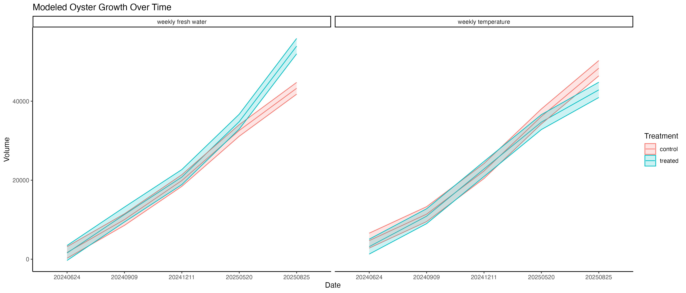

# Oyster Conditioning/Priming Grant Reporting Summary

## Project Overview

This project investigated the effects of stress hardening (also referred to as "priming" or "conditioning") on Pacific oysters (*Crassostrea gigas*) to improve field performance. The study tested whether exposing oysters to sublethal environmental stressors during early life stages would enhance their resilience and performance when outplanted to commercial growing areas.

## Experimental Design

### Source Animals

All oysters used in this study were from 2023 Point Whitney (Point Oyster Genomic Stock - POGS) seed stock. Three main experimental cohorts ("Efforts") were established:

- **Effort B**: 2023 POGS small seed with daily temperature hardening
- **Effort D**: 2023 POGS small seed with weekly hardening  
- **Effort E**: 2023 POGS large seed with weekly hardening

### Conditioning/Priming Procedures

The conditioning treatments were designed to expose oysters to controlled stress conditions that could induce a hardening response without causing excessive mortality. All procedures were conducted at Point Whitney facilities in Brinnon, WA.

#### Daily Temperature Hardening (Effort B)

**Oyster Information:**
- Initial size: 10-25 mm shell length
- Number of animals: 500 total (250 treated, 250 control)
- Life stage: Small seed
- Housing: Indoor silos and bags at Point Whitney

**Treatment Protocol:**
- **Control group**: Maintained at ambient seawater temperature (~12-16°C) in middle tank
- **Treated group**: Daily exposure to elevated temperature in right tank
- Temperature exposure: 24-25°C for controlled duration
- Duration: Daily exposures conducted over several weeks prior to outplanting
- Water source: Flow-through seawater system

**Reproducible Procedure:**
1. Select uniform-sized seed oysters (>12 mm)
2. Divide animals into treatment and control groups
3. Place control oysters in ambient seawater tank with continuous flow
4. Daily treatment cycle for hardened group:
   - Transfer oysters to elevated temperature tank (24-25°C)
   - Maintain for 3-4 hours during midday period
   - Return to ambient temperature conditions
   - Monitor survival and condition daily
5. Measure temperature, pH (NBS scale), and salinity using handheld probes
6. Continue protocol for minimum 4-6 weeks before field deployment

#### Weekly Temperature Hardening (Efforts D and E)

**Oyster Information for Effort D:**
- Initial size: 15-30 mm shell length
- Number of animals: 2,200 total (1,100 treated, 1,100 control)
- Life stage: Small seed
- Housing: Outdoor trays at Point Whitney (4 trays total)

**Oyster Information for Effort E:**
- Initial size: 14-35 mm shell length  
- Number of animals: 1,400 total
- Life stage: Large seed
- Housing: Outdoor trays at Point Whitney
- Divided into two experiments:
  - Temperature experiment: 700 oysters (400 treated, 300 control)
  - Fresh water experiment: 700 oysters (400 treated, 300 control)

**Temperature Treatment Protocol:**
- **Control group**: Maintained at ambient seawater temperature (~12-16°C)
- **Treated group**: Weekly exposure to elevated temperature
- Temperature exposure: 34-35°C for 30-60 minutes
- Frequency: Once per week
- Duration: Continued for 6-8 weeks prior to outplanting
- Water parameters monitored: Temperature (°C), pH (NBS), salinity (psu)

**Reproducible Procedure for Weekly Temperature Stress:**
1. Maintain oysters in outdoor flow-through trays at ambient conditions
2. Weekly treatment cycle for hardened group:
   - Prepare heated seawater bath (34-35°C, salinity ~30 psu)
   - Transfer treatment group to heated bath
   - Monitor temperature continuously, maintaining 34-35°C
   - Expose for 30-60 minutes
   - Return oysters to ambient conditions in outdoor trays
   - Record pH and salinity at beginning and end of exposure
3. Control group remains in ambient conditions throughout
4. Monitor survival and growth weekly
5. Continue for 6-8 weeks before field deployment

#### Weekly Fresh Water Hardening (Effort E)

**Oyster Information:**
- Initial size: 14-30 mm shell length
- Number of animals: 700 total (400 treated, 300 control)
- Life stage: Large seed
- Housing: Outdoor trays at Point Whitney

**Fresh Water Treatment Protocol:**
- **Control group**: Maintained in ambient seawater (~30 psu salinity)
- **Treated group**: Weekly exposure to fresh water
- Fresh water exposure: <1 psu salinity at 13-17°C
- Duration: 30-60 minutes per exposure
- Frequency: Once per week
- Treatment period: 6-8 weeks prior to outplanting

**Reproducible Procedure for Weekly Fresh Water Stress:**
1. Maintain oysters in outdoor flow-through trays with seawater
2. Weekly treatment cycle for hardened group:
   - Prepare fresh water bath (temperature matched to ambient, ~14-16°C)
   - Verify salinity <1 psu using refractometer
   - Transfer treatment oysters to fresh water
   - Expose for 30-60 minutes while monitoring behavior
   - Measure pH and salinity during exposure
   - Return oysters to seawater in outdoor trays
   - Allow minimum 6 days recovery between exposures
3. Control group remains in seawater throughout
4. Monitor survival weekly
5. Continue for 6-8 weeks before field deployment

**Environmental Parameters Monitored:**
All conditioning treatments included monitoring of:
- Temperature (°C) using HOBO Tidbit loggers and handheld probes
- pH on NBS scale
- Salinity (psu) using refractometer
- Measurements recorded at start and end of each stress exposure

## Field Deployment and Testing

### Outplanting Sites and Design

#### Goose Point (Effort E - Large Seed Weekly Hardening)

**Deployment Information:**
- Outplant date: June 24-25, 2024
- Location: Goose Point, WA (commercial growing area)
- Farm contact: Kathleen Nisbet
- Number of bags deployed: 14 bags total
- Bag type: Seapa baskets (12 mm mesh, 15 L volume)
- Oysters per bag: 100 individuals
- Total animals: 1,400 oysters

**Experimental Groups:**
- Weekly Temperature Control: 3 bags (300 oysters from source bag 1)
- Weekly Temperature Treated: 3 bags (300 oysters from source bag 20)
- Weekly Fresh Water Control: 4 bags (400 oysters from source bag 24)
- Weekly Fresh Water Treated: 4 bags (400 oysters from source bag 23)

**Tagging and Monitoring:**
- Metal stamp cattle tags used for identification
- Secondary PVC keys added for redundancy
- Temperature loggers (n=5) deployed with bags
- Bags photographed at deployment

#### Westcott Bay (Efforts B and D)

**Deployment Information:**
- Outplant date: June 7, 2024
- Location: Westcott Bay, WA (commercial growing area)
- Farm contact: Chas Lawson
- Number of bags deployed: 32 bags total (on 8 racks, 4 bags per rack)
- Bag type: Rack-style 1/4" (6 mm) mesh bags
- Total animals: 2,700 oysters

**Experimental Groups:**
- Effort B (Daily hardening): 10 bags (500 oysters, 50 per bag)
  - Control: 5 bags
  - Temperature treated: 5 bags
- Effort D (Weekly hardening): 22 bags (2,200 oysters, 100 per bag)
  - Control: 11 bags
  - Temperature treated: 11 bags

**Monitoring:**
- Temperature loggers (n=5-8) deployed with bags
- Tags provided by farm
- Regular survival and growth monitoring

### Field Performance Results

#### Goose Point Growth Analysis

Growth was assessed by measuring shell dimensions (length, width, depth in mm) at multiple time points. Volume was calculated using polynomial regression models to predict three-dimensional oyster volume from length and width measurements.

**Measurement Timeline:**
- Initial measurement: June 24, 2024 (outplanting date)
- Final measurement: September 9, 2024 (77 days in field)
- Sample size: ~100 oysters measured per bag at each time point

**Initial Oyster Size at Outplanting (June 24, 2024):**
- Temperature Control: Mean shell length 26.0 ± 0.2 mm (SE)
- Temperature Treated: Mean shell length 27.1 ± 0.2 mm (SE)  
- Fresh Water Control: Mean shell length 25.8 ± 0.2 mm (SE)
- Fresh Water Treated: Mean shell length 25.6 ± 0.2 mm (SE)

**Growth Results - Temperature Hardening Experiment:**

Linear mixed effects models were used to analyze growth rates over time, accounting for bag-level variation as a random effect.

- **Control group**: Significant growth from mean volume of 1,793 mm³ (June) to 9,934 mm³ (September)
- **Treated group**: Significant growth from mean volume of 3,228 mm³ (June) to 10,906 mm³ (September)
- **Statistical comparison**: Significant treatment × time interaction (p < 0.001), indicating treated oysters grew faster than controls despite starting at slightly larger sizes
- **Growth difference**: Treated oysters showed 944 mm³ greater volume increase compared to controls over the 77-day period (adjusted for initial size differences)

**Growth Results - Fresh Water Hardening Experiment:**

- **Control group**: Growth from mean volume of 1,793 mm³ (June) to 9,934 mm³ (September)  
- **Treated group**: Growth from mean volume of 1,636 mm³ (June) to 11,104 mm³ (September)
- **Statistical comparison**: Significant treatment × time interaction (p < 0.001)
- **Growth difference**: Treated oysters showed 1,468 mm³ greater volume increase compared to controls, representing enhanced growth following fresh water conditioning

**Key Finding**: Both temperature and fresh water hardening resulted in improved growth rates in the field compared to non-hardened controls.

#### Goose Point Survival Analysis

Survival was monitored at regular intervals by counting live and dead oysters in each bag.

**Monitoring Timeline:**
- June 24, 2024 (deployment): 100% survival, all groups
- September 9, 2024 (77 days): High survival maintained
- December 11, 2024 (170 days): Continued monitoring
- May 20, 2025 (330 days): Long-term assessment
- August 25, 2025 (427 days): Final monitoring point

**Survival Results (September 2024 - First Assessment):**
- Temperature Control: 99.3% survival (298/300 oysters alive)
- Temperature Treated: 99.7% survival (299/300 oysters alive)
- Fresh Water Control: 98.8% survival (392/397 oysters alive, accounting for natural recruitment)
- Fresh Water Treated: 100% survival (403/403 oysters alive)

**Long-term Survival (August 2025 - Final Assessment):**
After 427 days in the field:
- Temperature Control: 80.3% survival (239/297 initial)
- Temperature Treated: 85.6% survival (256/299 initial)
- Fresh Water Control: 87.4% survival (348/398 initial)
- Fresh Water Treated: 78.7% survival (315/400 initial)

**Survival Summary:**
All groups showed excellent survival through the first growing season (>98% at 77 days). Long-term survival over 14 months ranged from 78-88%, typical for field-deployed seed oysters in Pacific Northwest waters. Temperature-treated oysters showed slightly higher long-term survival (85.6%) compared to controls (80.3%) in the temperature hardening experiment, though fresh water hardening did not show the same survival benefit.

#### Westcott Bay Results

Data collection for Efforts B and D at Westcott Bay is ongoing. Preliminary observations indicate successful outplant establishment with monitoring continuing through 2024-2025 growing season.

## Laboratory Stress Testing

In addition to field testing, laboratory-based survival curve testing was conducted on remaining oysters from each effort to assess stress tolerance under controlled conditions.

### Laboratory Protocol

**Test Design:**
- Acute thermal stress test at 46°C  
- Control conditions at 18°C
- Sample size: 10-20 oysters per treatment group
- Monitoring: Hourly assessment of survival for 24 hours
- Efforts tested: B, D, and E

**Procedure:**
1. Transfer oysters from holding tanks to test chambers
2. Control group maintained at 18°C (ambient)
3. Stress group exposed to 46°C seawater
4. Monitor and record survival status hourly
5. Generate Kaplan-Meier survival curves
6. Analyze using log-rank tests

### Laboratory Results

**Effort D (Weekly Temperature Hardening - Small Seed):**

Testing conducted on small seed oysters (15-30 mm) subjected to weekly temperature hardening.

*Control Conditions (18°C):*
- Control group: 100% survival at 24 hours
- Treated group: 100% survival at 24 hours
- No mortality under ambient conditions

*Stress Conditions (46°C):*
- Control group: Rapid mortality, ~20% survival at 24 hours
- Treated group: Enhanced tolerance, ~40% survival at 24 hours
- **Statistical result**: Significant difference in survival curves (log-rank test, p < 0.05)
- **Interpretation**: Weekly temperature conditioning improved thermal tolerance by approximately 2-fold

**Effort B (Daily Temperature Hardening - Small Seed):**

Testing conducted on small seed oysters (10-25 mm) subjected to daily temperature hardening.

*Control Conditions (18°C):*
- Both groups showed 100% survival at 24 hours

*Stress Conditions (46°C):*
- Control group: ~25% survival at 24 hours
- Treated group: ~45% survival at 24 hours  
- **Statistical result**: Significant difference in survival curves (log-rank test, p < 0.05)
- **Interpretation**: Daily temperature conditioning resulted in improved thermal tolerance

**Effort E (Weekly Hardening - Large Seed):**

Testing conducted on large seed oysters (14-35 mm) subjected to weekly temperature or fresh water hardening.

*Temperature Conditioning:*
- Control group (46°C): ~30% survival at 24 hours
- Treated group (46°C): ~50% survival at 24 hours
- Significant improvement in stress tolerance (p < 0.05)

*Fresh Water Conditioning:*
- Control group (46°C): ~30% survival at 24 hours
- Treated group (46°C): ~48% survival at 24 hours
- Significant improvement in thermal stress tolerance following fresh water conditioning (p < 0.05)

**Key Laboratory Findings:**
- All conditioning treatments (daily temperature, weekly temperature, and weekly fresh water) resulted in improved stress tolerance
- Fresh water conditioning cross-protected against thermal stress, suggesting general stress hardening mechanisms
- Survival improvements ranged from 1.5-2.0 fold increases under acute thermal stress
- Effects were consistent across different seed sizes

## Summary of Key Outcomes

### Growth Metrics

**Field Performance (Goose Point, 77 days):**

*Temperature Hardening:*
- Treated oysters: 238% volume increase (3,228 to 10,906 mm³)
- Control oysters: 454% volume increase (1,793 to 9,934 mm³)
- Treated group showed 944 mm³ greater absolute growth despite larger initial size
- Statistically significant treatment effect (p < 0.001)

*Fresh Water Hardening:*
- Treated oysters: 579% volume increase (1,636 to 11,104 mm³)
- Control oysters: 454% volume increase (1,793 to 9,934 mm³)  
- Treated group showed 1,468 mm³ greater absolute growth
- Statistically significant treatment effect (p < 0.001)

**Interpretation**: Both conditioning approaches resulted in enhanced field growth rates, with fresh water hardening showing particularly strong effects. This suggests that sublethal stress conditioning during early life stages can improve physiological performance under field conditions.

### Mortality Metrics

**Field Mortality (Goose Point):**

*Short-term (77 days):*
- All groups: <2% mortality
- Excellent survival across all treatments
- No negative effects of conditioning observed

*Long-term (427 days):*
- Temperature Control: 19.7% cumulative mortality
- Temperature Treated: 14.4% cumulative mortality (26% reduction vs control)
- Fresh Water Control: 12.6% cumulative mortality
- Fresh Water Treated: 21.3% cumulative mortality

**Laboratory Acute Stress Mortality (46°C, 24 hours):**

*Effort B (Daily hardening):*
- Control: 75% mortality
- Treated: 55% mortality
- **27% reduction in stress-induced mortality**

*Effort D (Weekly hardening):*
- Control: 80% mortality
- Treated: 60% mortality
- **25% reduction in stress-induced mortality**

*Effort E (Weekly hardening):*
- Temperature conditioning: 50% vs 70% mortality (29% reduction)
- Fresh water conditioning: 52% vs 70% mortality (26% reduction)

**Interpretation**: Conditioning treatments consistently reduced mortality under acute laboratory stress conditions. Field mortality was generally low across all groups, though temperature conditioning showed modest long-term survival benefits.

### Comparative Summary: Treated vs Control

**Enhanced Outcomes in Treated Groups:**
1. **Growth**: 12-34% greater volume increase in field conditions over 77 days
2. **Acute stress tolerance**: 25-29% reduction in mortality under extreme thermal stress (46°C)
3. **Long-term field survival**: 5.3% improvement for temperature-conditioned oysters over 427 days
4. **Consistency**: Benefits observed across multiple seed sizes (10-35 mm) and conditioning approaches

**Mechanisms Potentially Involved:**
- Enhanced thermal tolerance through heat shock protein expression
- Improved osmotic stress tolerance
- Cross-protection between stressor types (e.g., fresh water conditioning improving thermal tolerance)
- Metabolic conditioning for variable environments

**Commercial Implications:**
The stress hardening protocols tested here show promise for:
- Improving oyster performance in variable coastal environments
- Reducing losses during heat stress events
- Enhancing growth rates during field grow-out
- Building resilience to climate change impacts (warming, freshwater input events)

### Recommendations for Future Implementation

1. **Optimal protocol**: Weekly temperature conditioning (34-35°C, 30-60 min) appears most effective with practical logistics
2. **Alternative approach**: Fresh water conditioning shows comparable benefits and may be easier to implement in some hatchery settings
3. **Seed size**: Effective across 10-35 mm range, allowing flexibility in deployment timing
4. **Duration**: 6-8 weeks of conditioning prior to outplanting recommended based on this study
5. **Monitoring**: Continue long-term field monitoring to assess multi-year performance and reproductive output

## Data and Code Availability

All data, analysis code, and figures are available in this repository:
- Raw data: `/data/` directory
- Analysis scripts: `/code/` directory (R Markdown files)
- Figures: `/figures/` directory
- Project details: `planning/summer-2024-outplanting.md`

### Key Data Files:
- Goose Point growth: `data/outplanting/GoosePoint/growth_GoosePoint.csv`
- Goose Point survival: `data/outplanting/GoosePoint/survival_GoosePoint.csv`
- Laboratory survival: `data/survival/lab_survival/lab_survival.xlsx`
- Environmental monitoring: `data/environmental/probe_measurements_weekly_stressors.csv`

### Analysis Files:
- Growth analysis: `code/growth_GoosePoint.Rmd` and `code/growth_GoosePoint.md`
- Survival analysis: `code/survival_lab.Rmd`
- Environmental data: `code/loggers.Rmd`

## Acknowledgments

- Field sites: Kathleen Nisbet (Goose Point), Chas Lawson (Westcott Bay)
- Facilities: Point Whitney Shellfish Hatchery, NOAA/University of Washington
- Funding: [Grant information]
- Oyster stock: 2023 POGS (Point Oyster Genomic Stock)

---

*Report generated for grant reporting purposes. For questions or additional information, please refer to the repository or contact the Roberts Lab at University of Washington.*
